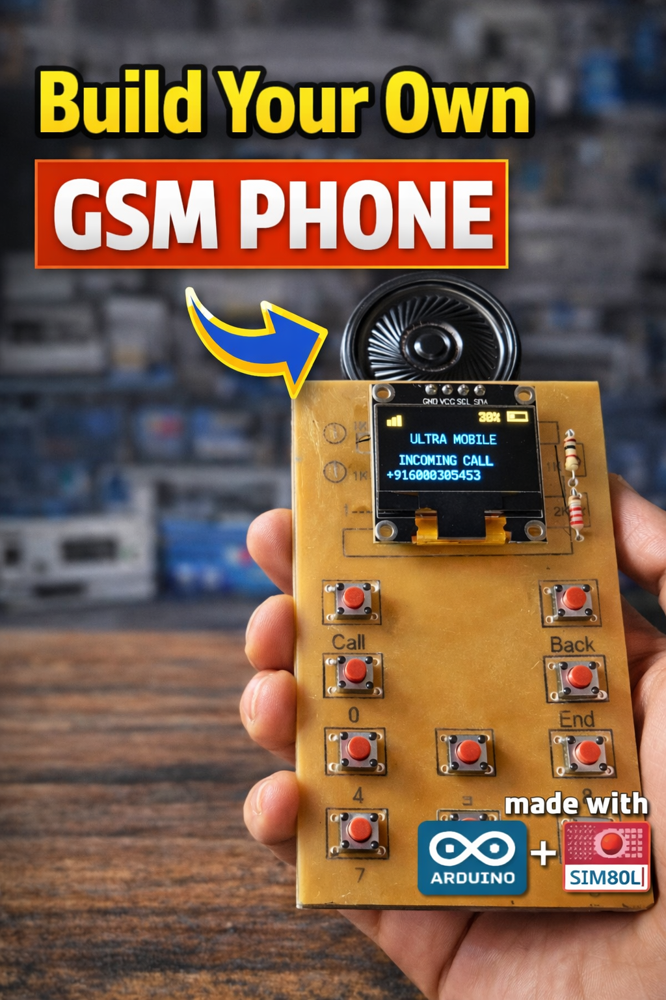

# DIY GSM Phone using Arduino Nano + SIM800L
⭐ Watch the full build tutorial on YouTube before using the code.

This project shows how to build a simple GSM mobile phone using Arduino Nano and SIM800L module.

## Features
- Call dialing
- OLED display
- Keypad input

## ⚠ Important
Do **NOT** power the SIM800L directly from Arduino 5V.  
Use a stable **4V power supply capable of at least 2A peak current**.

## Code
Code files are provided for **learning purposes**.  
If you use or modify this code, please **give credit to the channel**.

## 🎥 Full Video
https://youtu.be/v2U4mtbE_0Q?si=SHkOMxckTvtnDkQl

## 📺 Full Project Playlist
https://youtube.com/playlist?list=PLwa3JNSpvEczEKIIBchweiVA9gEsuzXuZ&si=4jYhwhmCoDElYSrZ
